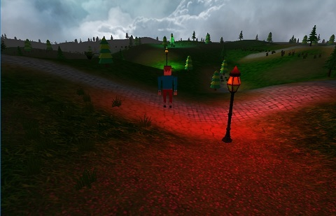

## GLSLEngine
----

[GlslEngine](https://coding.net/u/antyard/p/GlslEngine/git) 是一个轻量级的虚拟现实开发工具，目前共有类26个，代码2310行。其内容主要涵盖了着色器、相机、场景控制、地形、天空盒等方面，是大家学习计算机图形学一个非常好的途径。该项目目前处于开源状态，大家可以通过Git方式获取、学习。

----

### GlslEngine主要用到的库

&Theta; **glew:** GLEW是一个跨平台的C++扩展库，基于OpenGL图形接口。window目前只支持OpenGL1.1的涵数，但 OpenGL现在都发展到4.4以上了，要使用这些OpenGL的高级特性，就必须下载最新的扩展。

&Theta; **glfw:** 一个免费、开源、跨平台的OpenGL环境创建工具，并支持多屏显示、多种外设，取代了大家之前肯能较为熟悉的glut。

&Theta; **Assimp:** Open Asset Import Library，主要用于常用3D模型的加载，支持常见的3D模型格式大致有，3D Studio Max 3DS (3ds)、Wavefront Object (obj) 、Stanford Polygon Library (ply) 、Stereolithography (stl)等，关于更多的模型格式请参见Assimp文档。

&Theta; **SOIL:** Simple OpenGL Image Library， 该库用于加载图片，生成OpenGL环境中的纹理。支持的格式有BMP,PNG,JPG,TGA等。

----

<h2>学习参考资料</h2>

### GlslEngine的参考视频

下载地址：[http://pan.baidu.com/s/1jGrPI8u](http://pan.baidu.com/s/1jGrPI8u)

----

### LearnOpenGL

英文版：[http://www.learnopengl.com/](http://www.learnopengl.com/)

中文版：[http://learnopengl-cn.readthedocs.org/zh/latest/](http://learnopengl-cn.readthedocs.org/zh/latest/)

源码下载地址：[https://github.com/JoeyDeVries/LearnOpenGL](https://github.com/JoeyDeVries/LearnOpenGL)