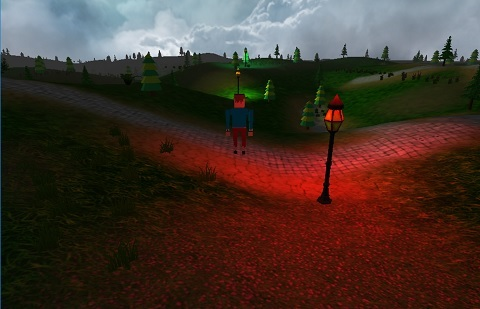

## 01. 深海ROV操作训练系统

----

职位描述：项目负责人

**项目描述：**该项目通过对水下自主机器人及其机械臂的相关操作模拟，达到训练操作人员的目的。该系统利用MFC框架实现交互界面、开源图形库Ogre3D和物理引擎Bullet分别实现视觉渲染和运动状态控制，系统通过采集HOTAS WARTHOG操纵杆的数据来实现对ROV及其附属机械臂的控制。利用网络通信，实现多台主机上的多屏幕下不同视角的同步显示。

**完成工作：**系统框架搭建、MFC界面和Ogre3D图形引擎的结合、物理引擎Bullet的集成、利用（Socket）套接字通信实现分屏显示、利用Bullet实现ROV的拖绳（软体）模拟。

### 02. AntEngine图形引擎的开发(进行中)

----

职位描述：项目负责人

**项目描述：**该项目定位于构建一个轻量级的图形渲染引擎。主要功能包括基于glfw的窗口构建、事件的响应、GLSL文件的解析、图片以及模型等资源的加载、多重纹理、地形、天空盒以及角色相机和碰撞检测等。利用该系统能够实现三维应用程序的快速开发。目前该项目仍在进行中，上述功能均已实现，后期工作将侧重于代码的优化和高级图形学知识的应用，如LOD和大场景的内存管理等方面，力争进一步提高该引擎的性能。

**完成工作：**OpenGL底层代码封装，包括工具类的编写、模型以及纹理贴图等资源的解析、天空盒、基于高程图的地形、多重纹理、引擎的整体测试、物理引擎Bullet的集成。

### 03. 软组织形变建模的研究（省自然基金项目）

----

职位描述：项目负责人

**项目描述：**利用计算机图形技术实现带有触觉反馈功能的虚拟手术训练仿真系统。首先对一组连续的CT图像进行三维重建，从而获得手术训练对象的几何模型，然后利用物理建模方法（如质点弹簧、有限元等）模拟软组织在外力作用下的形变效果。同时根据碰撞检测算法实时检测出虚拟手术器械与软组织模型之间的碰撞并计算相应反馈力的大小。

**完成工作：**系统整体框架搭建、质点弹簧模型和有限元方法的编程实现、数值解算方法编程实现、碰撞检测算法以及触觉反馈算法编程实现。

### 04. 微创血管介入手术机器人系统研究（国家863重点项目）

----

职位描述：虚拟仿真系统负责人

**项目描述：**该项目主要包括基于触觉反馈的介入手术硬件实现以及配套的虚拟手术训练系统。其中虚拟手术系统首先对大量的医学图像进行图像分割、配准和三维重建。然后对重建的三维血管模型进行物理建模，用于模拟血管软组织在外力作用下的形变效果，并将反馈力的大小实时地反馈至力反馈设备，从而达到训练外科医生、规划手术方案的目的。

**完成工作：**基于Chai3D开源触觉反馈的系统框架搭建、利用Amira软件对医学图像进行三维重建、软组织的形变建模、碰撞检测以及触觉反馈算法的编程实现。

### 05. 国际水下机器人竞赛仿真系统(IAUVC)

----

职位描述：碰撞检测模块负责人

**项目描述：**该项目组主要负责的是水下机器人的三维运动虚拟仿真，通过3D开源图形库OpenGL、面向对象语言c++在MFC对话框框架下，成功实现了水下场景的搭建（水流的流动、水中气泡的产生、水中能见度等），巡线、撞击目标物、射击、投掷、抓取等运动模拟，并实现了实时改变场景中物体的位置和观看视口的功能，主要用于比赛过程中的初期方案演示。

**完成工作：**仿真中整体虚拟场景的规划，实现虚拟机器人寻迹、投掷球、射球等动作，研究碰撞检测算法，实现机器人撞球、壁障等动作，网口通信编程及调试。

### 06. 多功能微型仿生鱼三维仿真系统（国家863项目）

----

职位描述：图形渲染模块负责人

**项目描述：**利用虚拟现实技术的机器鱼三维仿真系统是机器鱼研究开发中很好的图形交互工具。该项目主要用于研究机器鱼的避障能力；检验避障算法和行为策略的有效性；降低用实体机器鱼进行研究的成本和难度；减少对实体机器鱼的损害。通过建立较逼真的机器鱼模型和水下仿真环境，在开发的系统中实现虚拟场景中机器鱼的自主避障。

**完成工作：**利用3DSMAX建立仿生机器鱼模型，MFC界面设计，视景仿真环境建立，基于无特效的海底场景建模，碰撞检测算法研究。

### 07. 基于LeapMotion的交互式游戏设计

----

职位描述：项目负责人

**项目描述：**该课题主要利用Qt自带的OpenGL搭建一个图形渲染系统，通过读取三维模型，并生成Bullet碰撞检测可用的软体碰撞检测对象。然后通过实时读取LeapMotion的位置等相关信息，实现刚体球与软体对象进行碰撞检测，最后通过Bullet的实时解算完成模型的形变效果，达到交互游戏设计的目的。

**完成工作：**基于QtOpenGL的图形渲染框架搭建、LeapMotion交互实现、基于开源物理引擎Bullet的碰撞检测和形变仿真，几何模型与Bullet物理引擎的接口设计。

### 08. 柔软织物形变仿真平台的研究

----

职位描述：项目负责人

**项目描述：**该项目主要利用OpenGL实现布料等柔软织物在重力作用下与刚体对象的碰撞以及变形效果，该系统主要包括柔软织物和刚体等三维模型的加载、基于三角网格碰撞检测模型的匹配，纹理贴图等。通过该系统可进一步用于开发三维虚拟试衣系统。

**完成工作：**虚拟场景构建，基于Bullet碰撞检测和形变仿真，柔软织物的三维建模，纹理贴图，三维模型的加载，形变过程中数据的更新等任务。

### 09. 基于VxWorks的声呐图像处理系统

----

职位描述：VxWorks负责人

**项目描述：**该项目利用VxWorks的多线程机制、实时多任务功能、网络通信功能，实现对水下机器人实时采集的声呐图像的实时处理，并将相关数据保存至硬盘。然后利用网口通信以FTP的方式获取处理后的数据，在PC机上进行图像的显示机。

**完成工作：**VxWorks的调式，BOOTROM的制作，系统的定制等工作，套接字Socket编程等工作。

